## 项目简介

这是一个检测水面是否有漂浮物的项目，他将使用传统机器学习和现代深度学习的方法分别对数据集进行分类操作。

传统机器学习的方法将会包括：图像增强、图像分割、图像特征提取、机器学习分类

现代深度学习的方法将会使用一个由自己搭建的混合模型，一个缝合了自注意力机制的CNN模型。

本项目可以部署在监控或者无人机中检测水面上是否存在垃圾漂浮物，从而为环保尽一份力。

## 数据集介绍

数据集位于`./Trash_floaters_exist_classify`

本数据集”水面漂浮物“是一个用于图像分类的数据集，里面只有两个分类 `have_floaters`、 `no_floaters` 分别表示有、无漂浮物的水面。有漂浮物的图片大概600张，无漂浮物的图片大概300张。

这些图片来自于各个数据集网站、风景照网站的收集，仅作为学习使用

## 传统机器学习方法

### 图像增强

图像增强的代码放在了`./enhancing.py`中，图像增强的结果放在`./after_enhance`

图像增强具体步骤

**1.高斯滤波去噪**：使用尺寸可调的卷积核（如 3×3、5×7 等）对图像进行平滑，核越大去噪越强但细节丢失越多，默认核大小为 3×3。

**2.HSV色彩增强**：将图像转为 HSV 颜色空间，将饱和度（S）增加 30、亮度（V）增加 20，使颜色更饱和、明亮。

**3.CLAHE对比度增强**：转换到 LAB 空间，仅对亮度通道（L）进行分块直方图均衡化（块大小 8×8，对比度限幅 2.0），改善局部明暗对比。

**4.拉普拉斯锐化**：使用锐化核 `[[-1,-1,-1],[-1,9,-1],[-1,-1,-1]]` 对图像滤波，增强边缘与细节（不采用非锐化掩模 USM）。

图像增强效果展示：

原图

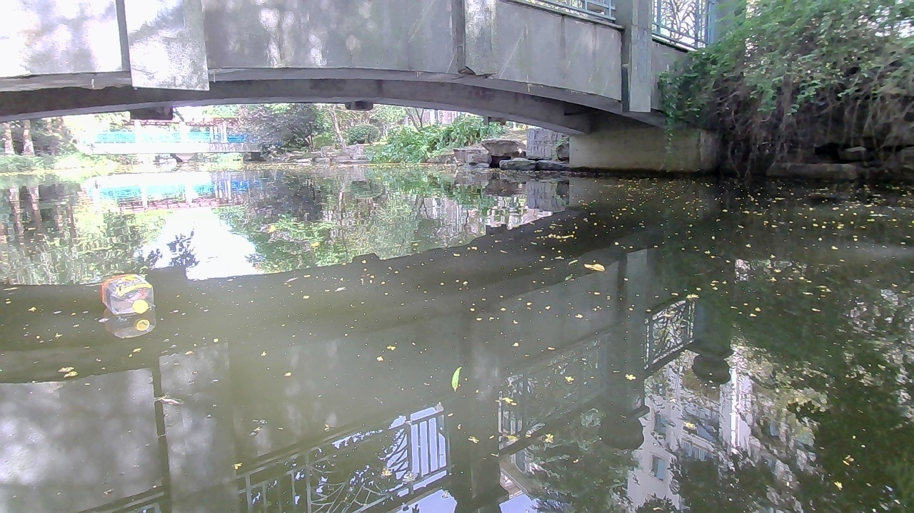

增强后的图

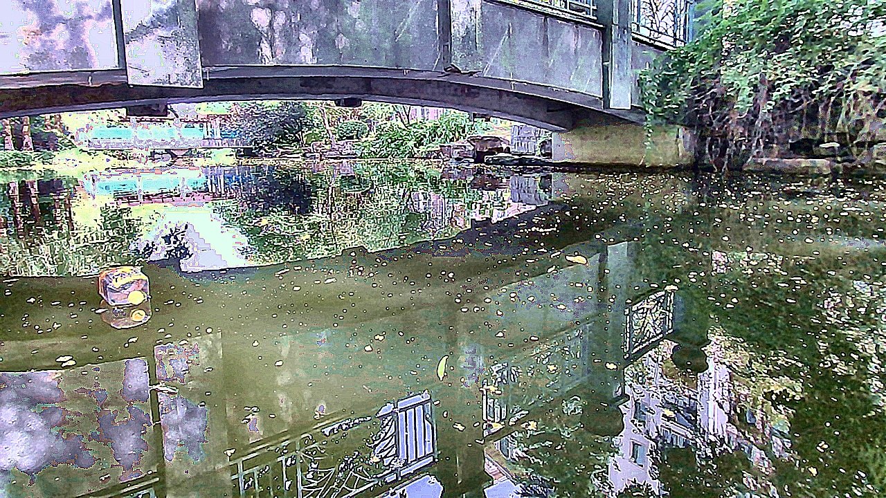

### 图像分割

图像分割在这个项目中是为了将水面切分出来，排除背景的干扰。代码放在了`./cropping.py`中，图像增强的结果放在`./after_cropping`

图像分割具体步骤

**1.自适应阈值分割**：将图像转为灰度图，使用 OTSU 算法自动计算阈值，生成二值图（前景为水面候选区）。

**2.中心连通域提取**：对二值图进行连通域分析，只保留质心位于图像中央 40% 矩形区域（`center_ratio=0.4`）的连通域，排除边缘杂质。

**3.形态学闭运算**：用 5×5 的结构元素对掩膜做闭运算（先膨胀后腐蚀），填充小孔、连接邻近区域。

**4.掩膜提取与保存**：用最终掩膜与原灰度图做按位与运算，截取出水面区域的灰度图像并保存。
另外，若图像像素超过 300 万，会自动缩放至限制内处理，最后将掩膜还原回原始尺寸。

图像分割最终效果

但是最终效果并不佳，图片之间差异过大，一套算法很难将所有的图片分割出较好的效果。图与图之间效果差异大，此算法仅仅适用于部分图片分割，因此不用于分类。

效果较好分割效果示例：

原图

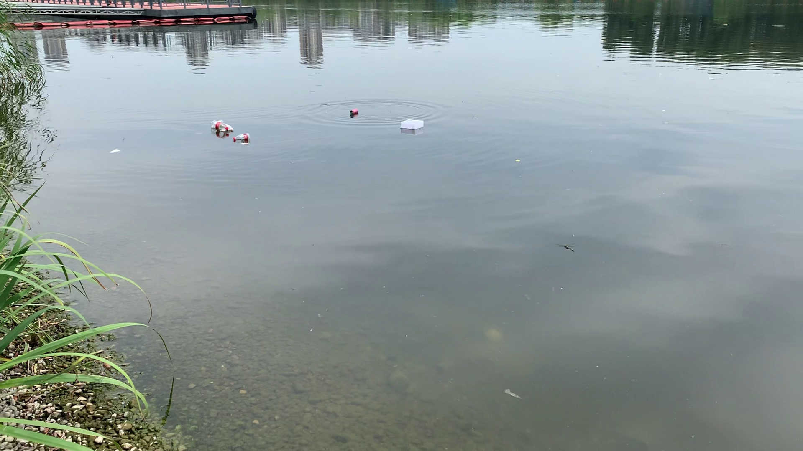

分割后图像

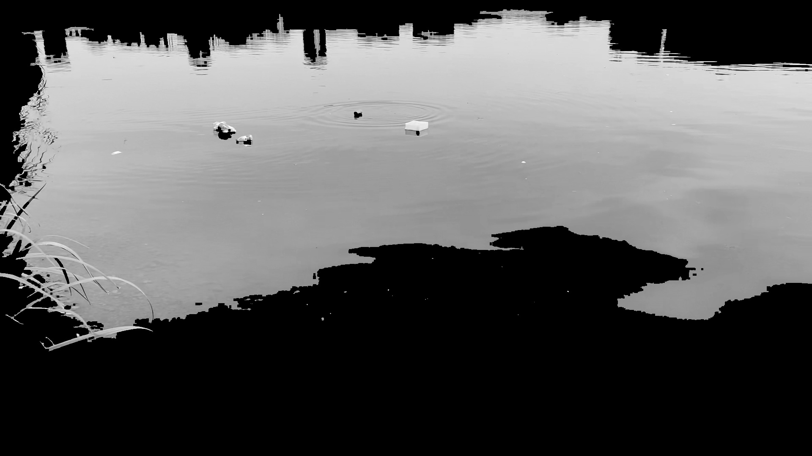

效果较差的分割效示例：

原图

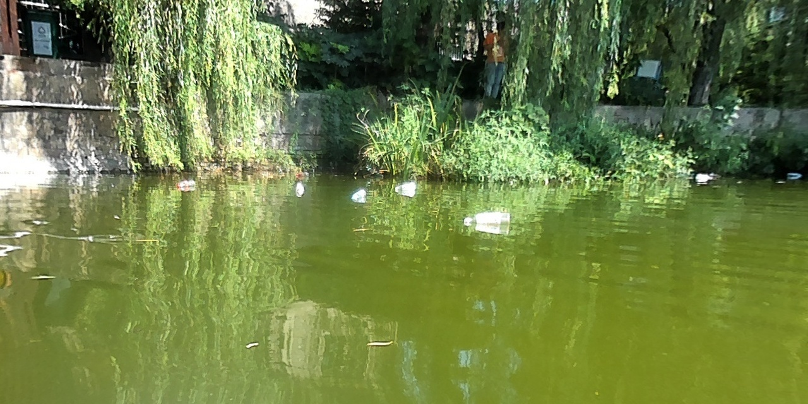

分割后图像

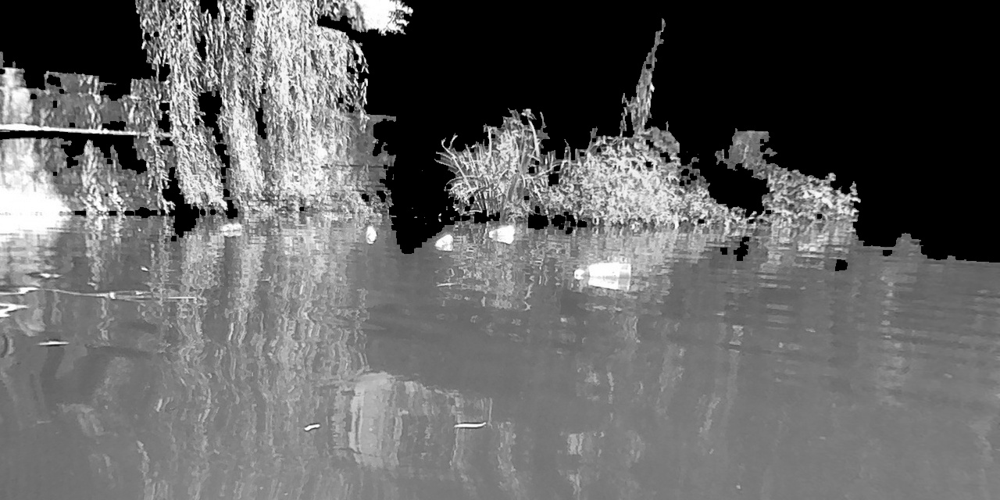

### 图像特征提取与分类

对于最初的数据集`./Trash_floaters_exist_classify`，我们使用脚本`SVM_classify.py`对他进行特征提取与分类，把最佳模型保存后，使用脚本`./detect_floater.py`进行单张图的预测。

**具体做法**

该程序首先对图像提取四类特征：GLCM 纹理特征、LBP 直方图、Hu 矩形状特征和 HSV/RGB 颜色统计，拼接后得到特征向量。然后对特征进行标准化（StandardScaler），使用 SVM 分类器，通过网格搜索（GridSearchCV）优化 C 和 gamma 参数，并在划分的训练/测试集上评估性能（分类报告、混淆矩阵），最后将最优模型和标准化器保存为 `.joblib` 文件。

#### SVM相关知识

**一、五个基本概念**：

**①支持向量机(Support Vectors Machine)**

找到一个最优的分类高维超平面，使得该平面在正确分开两类数据的同时，距离两类样本的“间隔”（margin）最大。

**②支持向量 (Support Vectors)**
训练数据中离分类决策边界最近的那些样本点。它们是确定最大间隔超平面的关键，SVM 的最优解仅由这些点决定，其余样本对模型没有贡献。这一特性使模型具有稀疏性和较好的泛化能力。

**③硬间隔 (Hard Margin)**
假设训练数据严格线性可分，要求所有样本不仅分类正确，还必须位于间隔边界之外，不允许任何误分类点。目标是在完全满足约束的前提下最大化分类间隔，对异常点敏感。

**④软间隔 (Soft Margin)**
允许部分样本不满足硬间隔的严格约束，通过引入惩罚项折衷间隔宽度与误分类数量。这样既能处理线性不可分或含噪声的数据，又能避免过拟合。惩罚系数 CC 控制对误分类的容忍度：CC 大则倾向硬间隔，CC 小则允许更多违规以换取更宽的间隔。

**⑤核函数 (Kernel Function)**
一种高效实现非线性分类的数学工具。它隐式地将原始输入映射到高维特征空间，并在该空间中直接计算映射到高维空间后两个样本点的内积，从而在原始空间构造出复杂的非线性决策边界。常用核函数如高斯径向基核 K(xi,xj)=exp⁡(−γ∥xi−xj∥2)K(xi,xj)=exp(−γ∥xi−xj∥2)，让 SVM 避免了显式高维映射的巨大计算代价。

**二、SVM具体计算流程：**

**1. 最直观的目标：找到一条“最宽”的分界线**

假设你要把二维平面上的 **○** 和 **×** 分开。SVM 不只满足于随便画一条能分开的直线，它的目标是：**找到一条直线，使得它到两类数据中最近点的距离都尽可能远**。

- 这条直线叫 **决策边界**（在高维叫超平面）。
- 两侧“留白的区域”叫 **间隔（margin）**。
- 离决策边界最近的那些数据点，就叫 **支持向量**，因为它们“支撑”着整个间隔。

把这条直线想象成一条河，SVM 就是要让河面**最宽**，两岸的地盘尽可能大。这样新来的点即使有些波动，也不太容易跨过河中心，分类就更稳健。

**2. 把几何直觉写成数学（硬间隔版本）**

假设数据点都是完美线性可分的。

决策直线方程可以写为：
**w·x + b = 0**

其中 **w** 是法向量（决定方向），**b** 是偏移量。一个点 **x** 到这条直线的距离是：

∣w⋅x+b∣∥w∥∥w∥∣w⋅x+b∣

（分母是 **w** 的长度，分子是未归一化的值。）

对于正类（+1）我们希望 **w·x + b > 0**，负类（-1）希望 **w·x + b < 0**。如果所有点都正确分类，就一定有
**yᵢ (w·xᵢ + b) > 0**。（yᵢ 是+1或-1）

我们希望整条线的**最小几何间隔**最大。为方便，我们可以规定：对于支持向量，那个未归一化的值正好等于 ±1。即要求所有点满足：

> **yᵢ (w·xᵢ + b) ≥ 1**

此时，对于支持向量，距离恰好是 1 / ‖w‖；对于其他点距离更大。
最大化这个最小间隔，就等于**最大化 1 / ‖w‖**，也就是**最小化 ‖w‖**。数学上常写为更方便求导的形式：

> 最小化 **(1/2) ‖w‖²**

同时要满足：

> **对所有 i，yᵢ (w·xᵢ + b) ≥ 1**

这就是 SVM 最基本的**硬间隔优化问题**。那个“满足……条件”就是你在前文看到的 `s.t.`，它是英文 “subject to” 的缩写，意思就是“约束条件是……”。

**3. 问题的巧妙转化：对偶与支持向量**

直接求解上面的带约束优化有点麻烦。通过**拉格朗日乘子法**可以把它转化成一个等价的“对偶问题”，这个新问题只和**数据点两两之间的内积**有关。

求解后你会发现两个重要事实：

- 最优的 **w** 可以表示为训练数据的线性组合：
  **w = Σ αᵢ yᵢ xᵢ**
  其中 αᵢ 是拉格朗日乘子。
- **大多数 αᵢ 会等于 0**，只有那些正好落在间隔边界上的点（支持向量）的 αᵢ 才大于 0。
  也就是说，**最终模型只由少数支持向量决定**，和其他点无关。

分类新点 **x** 时，只需计算：

> **f(x) = sign( Σ αᵢ yᵢ (xᵢ·x) + b )**

其中求和只对支持向量进行。b 也能从支持向量中计算出来。

**4. 数据不完全线性可分怎么办：软间隔 SVM**

现实数据难免有噪声，或者个别点跑到对方地盘里。硬间隔会因此无解或过度扭曲边界。所以引入**松弛变量 ξᵢ ≥ 0**，允许某些点“犯规”。

约束条件放宽为：

> **yᵢ (w·xᵢ + b) ≥ 1 − ξᵢ**

同时，目标函数中加上对这些犯错的惩罚：

> 最小化 **(1/2) ‖w‖² + C Σ ξᵢ**

这里的 **C** 是我们自己选的**惩罚系数**：

- C 很大 → 对犯错容忍度极低，几乎变成硬间隔；
- C 很小 → 允许更多点犯错，得到的边界更平滑、间隔更宽。

最终的对偶形式与硬间隔几乎一样，只多了一个上限：**0 ≤ αᵢ ≤ C**。

支持向量现在分为两类：

- 在间隔边上的点（0 < αᵢ < C），它们正确分类且恰好距离边界为 1；
- 在间隔内部甚至分错类的点（αᵢ = C），它们对应着 ξᵢ > 0。

**5. 数据本身就非线性可分：核技巧**

很多情况下，原始空间中压根找不到一条直线分开，比如下图同心圆。怎么办？

SVM 的做法是：**通过一个映射 φ，把数据“发”到高维空间，在高维空间里就可能线性可分了**。比如把二维的点 (x₁, x₂) 映射到三维 (x₁², x₂², √2 x₁x₂)，原来不可分的数据或许就能用一个平面切开。

但显式做这种映射计算量爆炸，而且维度可能无限。**核函数**完美解决了这个问题：我们不需要真的计算出 φ(x)，只需知道两个映射后向量的**内积**。定义一个函数 K 满足：

> **K(xᵢ, xⱼ) = φ(xᵢ) · φ(xⱼ)**

只要用核函数替换掉所有内积，SVM 就自动在高维空间里完成了线性分类，而我们根本没离开低维计算。

常用核函数：

- **线性核**：K(xᵢ, xⱼ) = xᵢ·xⱼ （就是原始线性 SVM）
- **多项式核**：K(xᵢ, xⱼ) = (xᵢ·xⱼ + c)ᵈ
- **高斯核（RBF）**：K(xᵢ, xⱼ) = exp( −γ ‖xᵢ − xⱼ‖² ) ，最常用，相当于映射到无穷维
- 等等

引入核之后，对偶问题的优化目标就变成：

> 最大化 **Σ αᵢ − 1/2 ΣΣ αᵢ αⱼ yᵢ yⱼ K(xᵢ, xⱼ)**
> 满足 **0 ≤ αᵢ ≤ C** 且 **Σ αᵢ yᵢ = 0**

决策函数变为：

> **f(x) = sign( Σ αᵢ yᵢ K(xᵢ, x) + b )**

这就是完整的非线性 SVM 分类器。求解时使用 SMO 等高效算法，计算只依赖核函数。

**6.一句话总结 SVM 在干什么**

SVM 的数学核心就是：在约束下求一个最大间隔的超平面。通过拉格朗日对偶把它变成更易解的形式，再借助核技巧把线性分类无缝拓展到非线性世界。最终的分类器仅由少量支持向量决定，模型结构极度稀疏，泛化能力很强。

**训练与测试结果**

最终传统机器学习方法的准确率能够到达98.66%，相当不错。

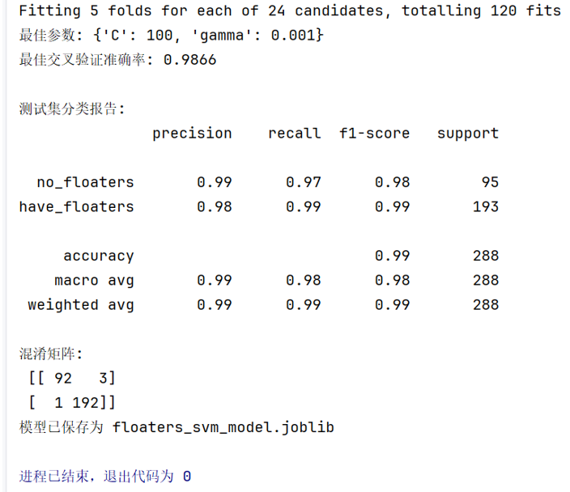

单张图预测结果

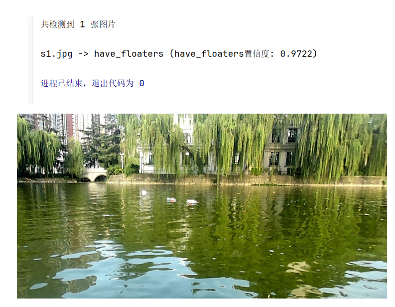

## 现代深度学习方法

### 深度学习模型介绍

深度学习中使用到的模型与本人另一个GitHub仓库中的模型结构基本一致，都是“缝合了自注意力机制的CNN模型”。对于它的具体结构的讲解省略，详见下面地址。

模型具体解释的GitHub地址：https://github.com/hide-self/SelfAttentionCNN_with_PGDattack

**模型网络参数架构**

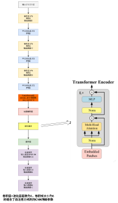

### 深度学习方法的训练与测试

缝合了自注意力机制的CNN模型在水面漂浮物数据集上的训练过程见Kaggle NoteBook

Kaggle NoteBook训练模型的地址：https://www.kaggle.com/code/hideself/selfattentioncnn-on-floaters-prediction

Kaggle NoteBook中训练过程的部分截图如下。可以看见训练的50轮次中准确率基本上大于95%，这足以见得这个模型的有效性，只不过后记各轮次中训练集上准确率达到了100%，而测试集上准确率一直在97.92%，这显然是出现了梯度消失的情况，这是一个可以改进的地方。最终最佳测试集准确率是98.44%，效果同样很好

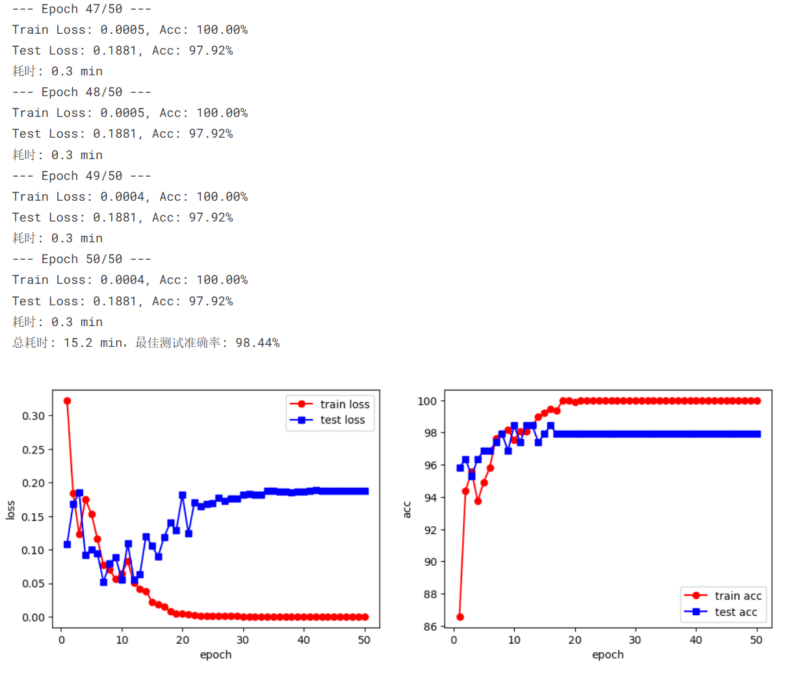

### 深度学习方法的单张图预测

单张图预测结果，通过这个深度学习模型，准确率能够达到99.51%，足以可见模型相当成功

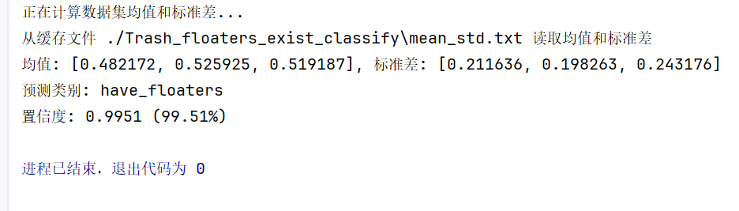

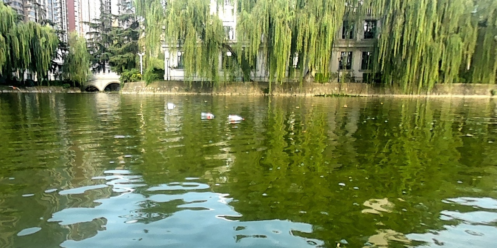

## 本作者邮箱联系方式

邮箱：[17751471191@163.com](mailto:17751471191@163.com)

Kaggle主页：<https://www.kaggle.com/hideself>

GitHub主页：<https://github.com/hide-self>